# 🤏 Gesture Volume Control

> Control your system volume by pinching your fingers — real-time hand gesture recognition using MediaPipe Hands and OpenCV, with scale-invariant landmark math and EMA smoothing.

   

---

## How It Works



| Gesture | Pinch ratio | Volume |
|---------|-------------|--------|
| Open hand | ratio > 1.2 | 100% |
| Wide pinch | ratio ≈ 0.9 | 75% |
| Mid pinch | ratio ≈ 0.6 | 50% |
| Tight pinch | ratio ≈ 0.3 | 25% |
| Closed fist | ratio < 0.15 | 0% / mute |

> **LM 4** (thumb tip) ↔ **LM 8** (index tip) distance, normalised by **LM 5 ↔ LM 17** hand span, mapped to 0–100% volume via `np.interp`.

---

## Pipeline

```
Webcam → cvtColor (BGR→RGB) → MediaPipe Hands (21 landmarks)
  → dist(LM4, LM8) / dist(LM5, LM17)  [normalised pinch ratio]
  → np.interp → raw_vol
  → EMA smooth (α=0.2) → smoothed_vol
  → OS volume API  (pycaw / osascript / amixer)
```

---

## Project Layout

```
gesture-volume-control/
├── gesture_volume.py    ← single entry point
├── requirements.txt     ← Python dependencies
├── .gitignore
├── assets/
│   └── demo_diagram.png
└── README.md
```

---

## Installation

```bash
git clone https://github.com/YOUR_USERNAME/gesture-volume-control.git
cd gesture-volume-control
```

**Windows**
```bash
pip install -r requirements.txt
```

## Usage

```bash
python gesture_volume.py
```

Press `q` to quit.

---

## Requirements

```
opencv-python
mediapipe
numpy
pycaw          # Windows only
comtypes       # Windows only
```

---

## Key Parameters

```python
ALPHA       = 0.2   # EMA smoothing (lower = smoother, more lag)
MIN_RATIO   = 0.15  # pinch ratio → 0% volume
MAX_RATIO   = 1.2   # pinch ratio → 100% volume
CONFIDENCE  = 0.7   # detection + tracking confidence
```

---

## Topics

`computer-vision` `mediapipe` `opencv` `gesture-recognition` `hand-tracking` `python` `volume-control` `real-time` `landmark-detection`

---

## License

MIT
